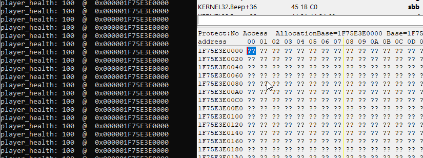

# datacave
hide data in no_access memory pages. when accessed internally, the data will temporarily become visible. \
this is useful against external memory reads (cheats, stealers, etc). \
the data will be hidden again after a very short time frame. \
additionally, the data is not just hidden but also encrypted (simple xor) 

# note
i made this as a poc. it is not intended to work perfectly. \
if you find an issue, feel free to let me know!

# example:

```cpp
struct player_t
{
    u64 health;
};

int main()
{
    datacave::initialize();

    // allocate a player in a data-cave
    player_t* player = (player_t*)datacave::allocate_memory(sizeof(player_t));
    player->health = 100;

    while (true)
    {
        printf("player_health: %d  @  0x%p\n", player->health, &player->health);

        // always re-lock all unlocked pages
        datacave::lock_all();

        Sleep(1000);
    }
}
```

this will make sure all caves are encrypted and hidden again. \
this pretty much defines how big of a performance hit you want. \
make should be called periodically (example: every tick, every 100 ms, etc...). \
calling it less often will result in less exceptions (aka. less cpu usage).
```cpp
datacave::lock_all();
```
